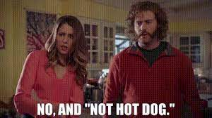

# Hot-dog-Not-hot-dog-Classifier

A binary classifier to test whether an image belongs to the "hot dog" class or the "not hot dog" class, as seen on HBO's [*Silicon Valley*](https://www.bing.com/videos/riverview/relatedvideo?&q=hot+dog+not+a+hot+god+silicon+valley&&mid=162A96163FFFB5F6FCB1162A96163FFFB5F6FCB1&&FORM=VRDGAR).

# Hot Dog Classification with Transfer Learning

This project demonstrates how to use transfer learning to build a binary classifier that can distinguish between images of hot dogs and images of "not hot dogs." Four different pre-trained models are used: InceptionV3, MobileNetV2, ResNet50, and VGG16.

The [Hot dog - Not hot dog](https://www.kaggle.com/datasets/dansbecker/hot-dog-not-hot-dog) Kaggle dataset is used for training and validation. The images are preprocessed and augmented using the `RandomFlip` and `RandomRotation` layers from the `tensorflow.keras.layers.experimental.preprocessing` module.

The pre-trained models are loaded with weights from the ImageNet dataset and fine-tuned on the training data. The models are compiled with the Adam optimizer, binary cross-entropy loss, and accuracy metric.

After training, the models achieve the following validation accuracies:

| Model       | Validation accuracy (after 5 epochs with pre-trained ImageNet weights) | Validation accuracy (after 5 epochs with fine-tuning from layer 0 onward) |
|-------------|-----------------------------------------------------------------------|---------------------------------------------------------------------------|
| InceptionV3 | 0.9397                                                                | 0.9397                                                                    |
| MobileNetV2 | 0.9095                                                                | 0.9146                                                                    |
| ResNet50    | 0.8894                                                                | 0.9045                                                                    |
| VGG16       | 0.8141                                                                | 0.8141                                                                    |
                                                                     |

Hot dog! 

Paper references:

This project provides a starting point for building image classification models using transfer learning with pre-trained models in TensorFlow and Keras. Hot dog! 

